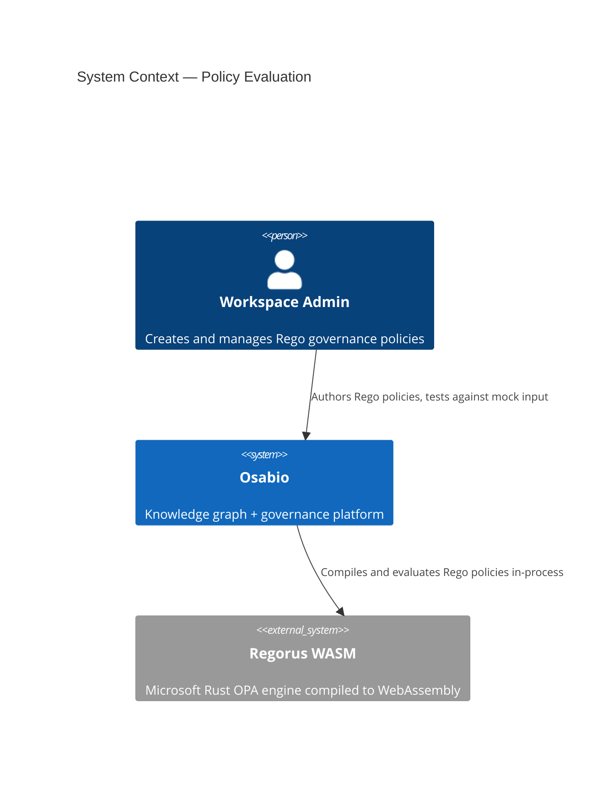
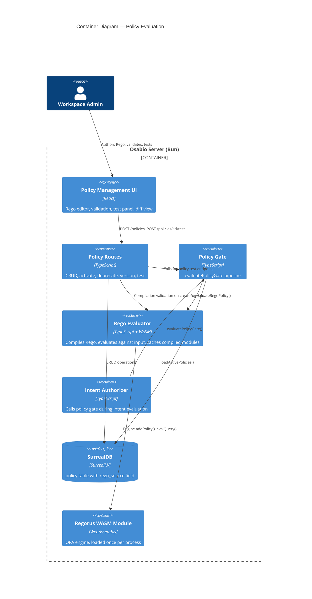
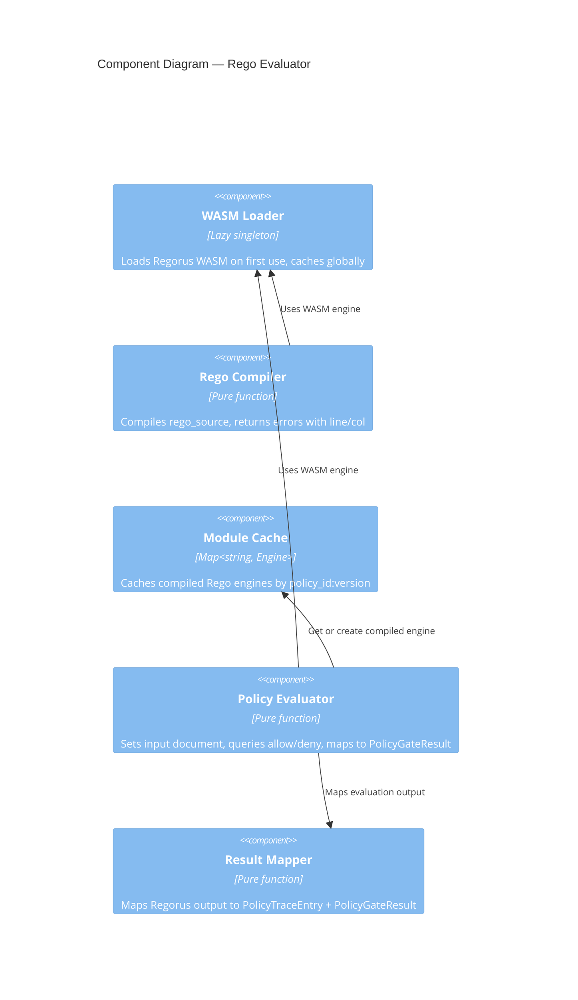

# Architecture Design: Regorus Policy Evaluation Engine

## Quality Attribute Priorities

1. **Testability** — policies must be testable against mock input before activation
2. **Maintainability** — single evaluation path, no dual-engine complexity
3. **Performance** — p99 < 5ms per policy evaluation (sub-millisecond is expected from Regorus)
4. **Security** — WASM sandbox isolates policy execution from host process

## Architecture Pattern

**Modular monolith with pure-core / effect-shell**. This feature replaces the evaluation engine inside the existing policy module — it is not a new service or module boundary. The existing `policy-gate.ts` pipeline pattern (single effect boundary + pure pipeline) is preserved, with the predicate evaluator swapped for a Rego evaluator.

## C4 System Context



## C4 Container



## C4 Component — Rego Evaluator



## Data Flow

```
Intent Created
  │
  ▼
evaluatePolicyGate(surreal, identityId, workspaceId, intentContext)
  │
  ├─ [EFFECT] loadActivePolicies(surreal, identityId, workspaceId)
  │    └─ Returns PolicyRecord[] with rego_source field
  │
  ├─ [PURE] deduplicatePolicies(policies)
  │
  ├─ [PURE] For each policy (priority-sorted):
  │    ├─ getOrCompileEngine(policy.id, policy.version, policy.rego_source)
  │    │    ├─ Cache hit → return cached Engine
  │    │    └─ Cache miss → Engine.addPolicy(rego_source) → cache → return
  │    │
  │    ├─ evaluateRegoPolicy(engine, intentContext)
  │    │    ├─ engine.setInputJson(JSON.stringify(intentContext))
  │    │    ├─ engine.evalQuery("data.osabio.policy.allow")
  │    │    ├─ engine.evalQuery("data.osabio.policy.deny")
  │    │    └─ Return { allow: boolean, deny: string[] }
  │    │
  │    ├─ mapToTraceEntry(policyId, version, regoResult)
  │    │
  │    └─ If deny → short-circuit, return PolicyGateResult { passed: false }
  │
  └─ [PURE] buildGateResult(evaluatedPolicies, warnings)
       └─ Return PolicyGateResult { passed: true/false, policy_trace, ... }
```

## Key Design Decisions

### D1: Git submodule + vendored WASM build output

Regorus has no published npm package. We use a two-directory approach:

- `vendor/regorus-src/` — git submodule tracking `https://github.com/microsoft/regorus` at a pinned commit. Provides version tracking and easy upgrades. Never initialized in CI.
- `vendor/regorus-wasm/` — pre-built WASM artifacts committed to git. This is what the code imports.

**Build and upgrade workflow**:
```bash
# Build from submodule source
cd vendor/regorus-src/bindings/wasm
wasm-pack build --target nodejs --release
cp -r pkg/* ../../regorus-wasm/

# Upgrade: checkout new tag, rebuild, commit both
cd vendor/regorus-src && git fetch && git checkout v0.X.Y
cd bindings/wasm && wasm-pack build --target nodejs --release
cp -r pkg/* ../../regorus-wasm/
```

The vendored build output contains:
- `regorusjs_bg.wasm` (~2MB compiled WASM binary)
- `regorusjs.js` (JS glue code generated by wasm-bindgen)
- `regorusjs.d.ts` (TypeScript types)

### D2: Engine-per-policy caching with Map

Each compiled Rego policy gets its own `Engine` instance. Cached in a `Map<string, Engine>` keyed by `${policyId}:${version}`. Cache is process-global (not per-workspace) because policy IDs are globally unique.

**Why Map, not LRU**: The number of active policies per Osabio instance is small (typically < 50). Memory pressure from cached engines is negligible. LRU adds complexity for no measurable benefit at this scale.

**Invalidation**: New policy version = new cache key. Old entries are evicted when the policy is superseded/deprecated (or left for GC — the Map holds Engine instances, not large data).

### D3: Engine API (interpreter mode)

Use the `Engine` class (interpreter mode), not `Program`/`Rvm` (compiled mode). Interpreter mode is simpler, sufficient for governance policy complexity, and avoids the serialization overhead of the compiled binary format. If benchmarks show interpreter mode exceeds the 5ms target, upgrade to `Program` compilation with binary caching.

### D4: Rego package convention

All policies must use `package osabio.policy`. The evaluator queries:
- `data.osabio.policy.allow` → boolean (default `false`)
- `data.osabio.policy.deny` → set of message strings

The compilation validator rejects policies that don't declare `package osabio.policy`.

### D5: Evidence requirements via Rego output

The current `evidence_requirement` effect on predicate rules maps to a Rego output field:
```rego
evidence_requirement := {
  "min_count": 2,
  "required_types": ["decision", "task"]
} if {
  input.action_spec.action == "deploy_production"
}
```

The evaluator queries `data.osabio.policy.evidence_requirement` and maps it to `PolicyEvidenceRequirements`.

### D6: No `data` document beyond `input`

The Rego `input` document is the `IntentEvaluationContext` (which already includes behavior scores, action spec, budget, etc.). No additional `data` document is loaded. This keeps evaluation hermetic and fast — the evaluator doesn't need DB access.

If future policies need workspace context beyond what's in `IntentEvaluationContext`, extend the context type rather than introducing a separate `data` loading mechanism.

## Integration Points

| Existing Component | Change |
|---|---|
| `policy/types.ts` | Remove `RulePredicate`, `RuleCondition`, `PolicyRule.condition`. Add `rego_source` to `PolicyRecord`. Keep `PolicyGateResult`, `PolicyTraceEntry`, `IntentEvaluationContext` unchanged. |
| `policy/policy-gate.ts` | Replace `evaluateRulesAgainstContext` + `evaluateCondition` calls with `evaluateRegoPolicy`. Remove `AnnotatedRule`/`EvaluatedRule` types. Keep `deduplicatePolicies`, `buildGateResult` pipeline structure. |
| `policy/predicate-evaluator.ts` | Delete entirely. |
| `policy/policy-validation.ts` | Replace predicate validation with Rego compilation check. |
| `policy/policy-queries.ts` | No change to `loadActivePolicies`. Schema migration handles field rename. |
| `policy/policy-route.ts` | Update create handler to accept `rego_source` instead of `rules`. Add `POST /:id/test` endpoint. |
| `intent/authorizer.ts` | No change — calls `evaluatePolicyGate` with same signature. |
| `schema/surreal-schema.surql` | Remove `rules[*].condition*` fields, add `rego_source` string field. |
| `app/src/client/components/policy/RuleBuilder.tsx` | Replace with Rego editor component. |
| `app/src/client/components/policy/CreatePolicyDialog.tsx` | Replace `RuleBuilder` integration with Rego editor. |
| `tests/unit/policy-gate.test.ts` | Rewrite to test Rego evaluation instead of predicate evaluation. |
| `tests/unit/policy-validation.test.ts` | Rewrite to test Rego compilation validation. |
| `tests/acceptance/policy-node/` | Update to create Rego policies instead of predicate policies. |
