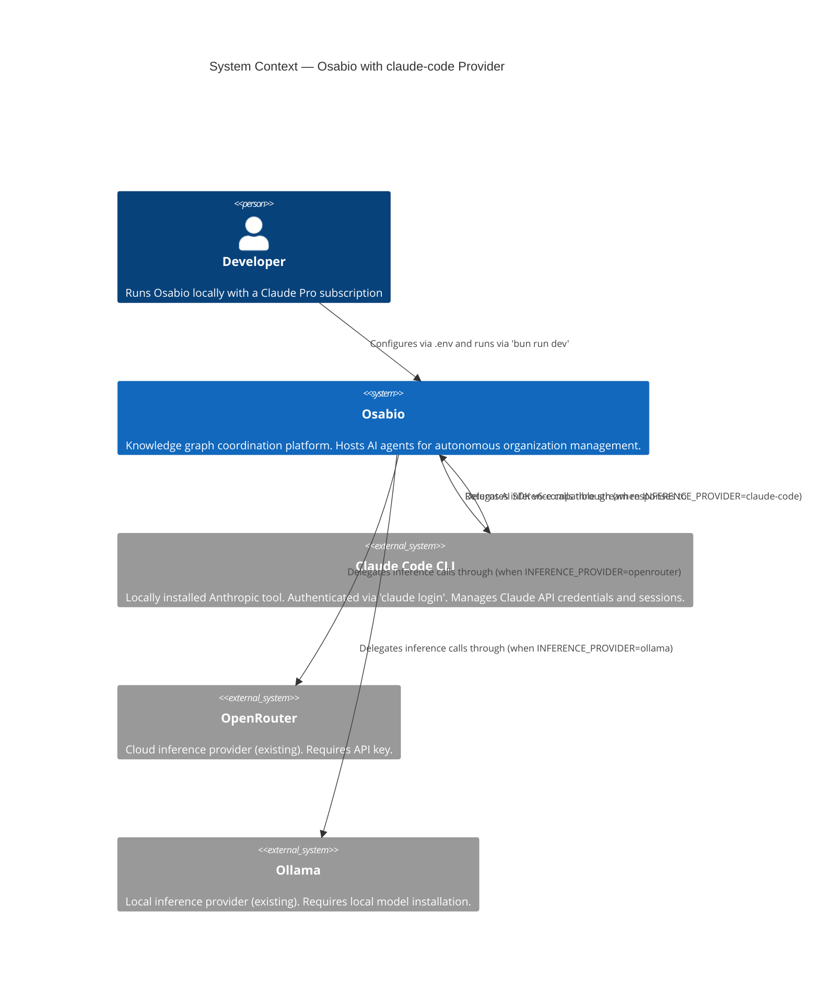
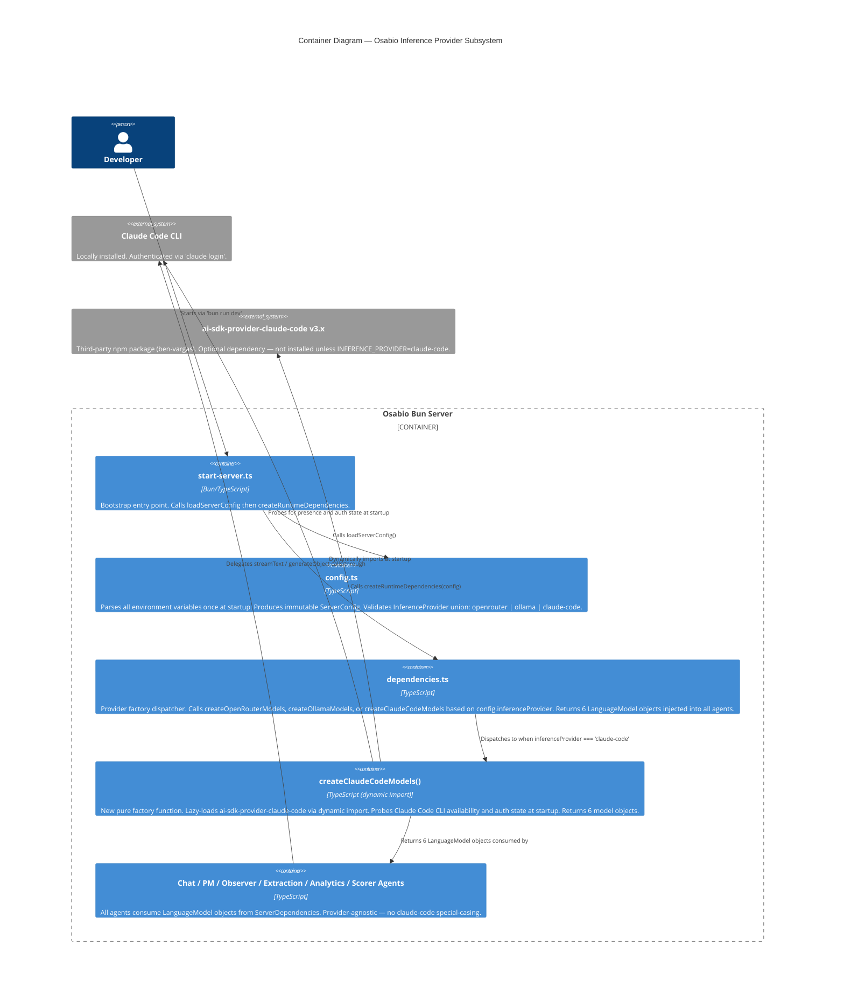

# Architecture Brief — Osabio

## System Architecture

> This section is reserved for platform-level decisions (Titan). No prior content exists.

---

## Domain Model

> This section is reserved for domain model decisions (Hera). No prior content exists.

---

## Application Architecture

### Feature: claude-agent-sdk-provider

**Owner**: Morgan (Solution Architect, DESIGN wave)
**Date**: 2026-04-16
**ADR**: `docs/product/architecture/adr-claude-provider.md`

---

### System Context



---

### Container Diagram



---

### Architecture Options Considered

Three options were evaluated before selecting the approach:

#### Option A: Inline Dispatch with Dynamic Import (SELECTED)

Extend the existing ternary dispatch in `dependencies.ts` with a third branch. The new factory `createClaudeCodeModels()` lives in the same file as `createOpenRouterModels()` and `createOllamaModels()`. The package `ai-sdk-provider-claude-code` is loaded via `await import(...)` inside the factory body — identical to the existing `sandbox-agent` dynamic import pattern at lines 84–88.

- Blast radius: 2 files changed (`config.ts`, `dependencies.ts`) + 1 new test file
- Consistency: follows existing factory function convention exactly
- Optionality: dynamic import means the package is not bundled unless the branch executes
- DX simplicity: crafter reads one function, sees the pattern, implements
- Trade-off: all three factory functions in one file; file grows by ~40 lines

#### Option B: Separate Module with Re-export

Create `runtime/providers/claude-code.ts` as a dedicated module, import it from `dependencies.ts` via a static import wrapped in a conditional dynamic import trick.

- Blast radius: 3 files changed + 1 new module
- Consistency: departs from current pattern (openrouter/ollama factories are inline)
- No meaningful DX gain for a 40-line addition
- Rejected: added indirection without commensurate benefit

#### Option C: Provider Registry Map

Create a `Map<InferenceProvider, () => Promise<ModelFactory>>` registry object that maps provider strings to factory loader functions.

- Blast radius: new registry abstraction + config changes
- Premature generalization: three providers do not justify a registry
- Harder to understand at a glance than a ternary chain
- Rejected: YAGNI — adds complexity without solving a real problem at current scale

**Decision**: Option A. Simplest extension, zero new abstractions, zero new files beyond the test, consistent with existing patterns. See `adr-claude-provider.md`.

---

### Component Boundaries

#### `config.ts` — Extended (not replaced)

Responsibilities (unchanged + additions):
- Parse all environment variables once at startup
- Validate `InferenceProvider` union (add `"claude-code"`)
- Parse optional `CLAUDE_CODE_EFFORT` (values: `low`, `normal`, `high`)
- Parse optional `CLAUDE_CODE_MAX_BUDGET_USD` (positive number)
- Do NOT require `OPENROUTER_API_KEY` when provider is `claude-code`

New `ServerConfig` fields:
- `claudeCodeEffort?: "low" | "normal" | "high"` — omitted when unset
- `claudeCodeMaxBudgetUsd?: number` — omitted when unset

Error contract: all validation errors throw at parse time with actionable messages listing valid values.

#### `dependencies.ts` — Extended (not replaced)

New function: `createClaudeCodeModels(config: ServerConfig, wrap: (model: any) => any)`

Responsibilities:
- Dynamic import of `ai-sdk-provider-claude-code` (lazy — only executes when `inferenceProvider === "claude-code"`)
- Startup probe: detect missing CLI and unauthenticated state before returning model objects
- Return the standard 6-field model object: `{ chatAgentModel, extractionModel, pmAgentModel, analyticsAgentModel, observerModel, scorerModel }`
- Forward `claudeCodeEffort` and `claudeCodeMaxBudgetUsd` to provider when present in config

Probe contract (Earned Trust — Principle 12): the factory MUST probe the Claude Code CLI at startup, not lazily. Probe must cover:
1. Package presence: if `await import("ai-sdk-provider-claude-code")` fails, throw with install command
2. CLI presence: if Claude Code binary is not found in PATH, throw with `npm install -g @anthropic-ai/claude-code`
3. Auth state: if CLI is present but unauthenticated, throw with `claude login`

Model ID contract: the factory uses the existing model ID env vars (`CHAT_AGENT_MODEL`, `EXTRACTION_MODEL`, `PM_AGENT_MODEL`, `ANALYTICS_MODEL`, `OBSERVER_MODEL`, `SCORER_MODEL`) via `config.chatAgentModelId`, `config.extractionModelId`, etc. — identical to OpenRouter and Ollama. No new model ID env vars are introduced. The crafter calls `claudeCode(config.chatAgentModelId)` for the chat model, `claudeCode(config.extractionModelId)` for the extraction model, and so on. Valid model IDs for the claude-code provider are Claude model identifiers (e.g., `claude-sonnet-4-5`, `claude-haiku-4-5`).

Budget exhaustion contract: when `CLAUDE_CODE_MAX_BUDGET_USD` is exceeded during an inference call, the provider is expected to throw an error from the `streamText()` / `generateObject()` call. This error propagates through the AI SDK streaming pipeline and surfaces in the chat stream as a human-readable error message. The server continues accepting new requests. The smoke test (US-03) must validate this behavior — if the provider does not support budget caps at this granularity, the config option should be removed and documented as unsupported.

Probe failures must cause the server to refuse to start (throw before `createRuntimeDependencies` resolves). No port binding occurs on probe failure.

Dispatch update: the binary ternary at line 62–65 becomes a three-way conditional:

```
inferenceProvider === "claude-code"
  → createClaudeCodeModels(config, wrap)      [new branch]
inferenceProvider === "ollama"
  → createOllamaModels(config, wrap)
default
  → createOpenRouterModels(config, wrap)
```

#### Agents (unchanged)

No changes to chat agent, PM agent, observer, extraction pipeline, analytics agent, or scorer. All consume `LanguageModel` objects from `ServerDependencies`. Provider selection is invisible above the `dependencies.ts` boundary.

---

### Technology Stack

| Component | Technology | License | Rationale |
|-----------|-----------|---------|-----------|
| Provider package | `ai-sdk-provider-claude-code` v3.x | MIT (ben-vargas/ai-sdk-provider-claude-code) | Only OSS AI SDK v6-compatible adapter for Claude Code CLI; no viable alternative |
| AI SDK interface | Vercel AI SDK v6 (`ai` package) | Apache-2.0 | Already in use; provider package must conform to its `LanguageModel` interface |
| Runtime | Bun | MIT | Already in use; dynamic import works identically to Node.js |
| Package classification | `dependencies` in `package.json` | — | This is an app, not a library — always install; no conditional install logic needed |

**Package classification decision**: `dependencies` (not `optionalDependencies`, `devDependencies`, or `peerDependencies`).
- This is an application, not a library. All runtime dependencies belong in `dependencies` and are always installed.
- `optionalDependencies` is appropriate for libraries that want to avoid forcing transitive installs on consumers — that concern does not apply here.
- `devDependencies`: excluded from production `bun install --production` — server would fail at runtime when `INFERENCE_PROVIDER=claude-code`
- `peerDependencies`: places install burden on the user explicitly; bun does not auto-install peers

---

### Integration Patterns

#### Provider Boundary Contract

The Claude Code factory produces `LanguageModel` objects that conform to the Vercel AI SDK v6 `LanguageModel` interface. All six objects must be structurally identical to those produced by `createOpenRouterModels()` and `createOllamaModels()` — no additional wrapping or protocol translation at the call site.

**External integration annotation**: `ai-sdk-provider-claude-code` (npm, ben-vargas) is an external third-party package. The smoke test (US-03) serves as the integration validation gate. Recommended: include smoke test in CI to catch breaking package updates. Pact-style consumer-driven contract tests are not applicable here (the "contract" is the Vercel AI SDK `LanguageModel` TypeScript interface, enforced at compile time by TypeScript).

#### Startup Sequence

```
loadServerConfig()
  → parseInferenceProvider() validates union
  → parseClaudeCodeEffort() validates optional enum
  → parseClaudeCodeMaxBudgetUsd() validates optional positive number
  → returns immutable ServerConfig

createRuntimeDependencies(config)
  → [if claude-code] createClaudeCodeModels(config, wrap)
      → await import("ai-sdk-provider-claude-code")   [probe 1: package present]
      → probe CLI presence                            [probe 2: binary in PATH]
      → probe auth state                              [probe 3: authenticated]
      → create 6 model objects with options
      → return model map
  → wire remaining deps (Surreal, Auth, AsSigningKey, etc.)
  → return ServerDependencies

startServer() calls createBrainServer(deps) → binds port
```

Invariant: port binding never occurs if any probe fails.

---

### Quality Attribute Strategies

#### Maintainability
- Factory function follows existing naming convention (`createXModels`)
- No new abstraction layers — pattern is immediately recognizable to maintainers
- `InferenceProvider` type union is the single authoritative registry of providers

#### Reliability
- Fail-fast startup: all three probe failures throw before port binding
- Error messages are actionable: each failure case names the exact command to run
- Budget exhaustion is a per-request error, not a server-level failure — server continues running

#### Testability
- Config parsing (`loadServerConfig`) is a pure function — unit-testable without running the server
- Factory function accepts `config: ServerConfig` — testable with mock config values
- Smoke test uses `configOverrides` pattern — no `process.env` mutation in tests
- Probe logic is isolated within `createClaudeCodeModels` — can be exercised independently

#### Portability (non-headless constraint)
- The claude-code provider requires an interactive host with Claude Code installed and authenticated
- Not suitable for Docker containers, Kubernetes pods, or any headless deployment
- README must document this constraint (US-04)
- Operators in headless environments must use `openrouter` or `ollama`

#### DX (Developer Experience)
- Three env vars to switch providers: `INFERENCE_PROVIDER`, `CHAT_AGENT_MODEL`, `EXTRACTION_MODEL` (and optionally 4 more)
- One config change vs 5+ for OpenRouter
- Error messages reference exact remediation commands

---

### Architectural Enforcement

**Tooling**: TypeScript's type system enforces the `InferenceProvider` union at compile time. Any addition of a fourth provider requires updating the union — the compiler catches unhandled branches in exhaustive checks.

**Recommendation for crafter**: use a discriminated union exhaustive check pattern in `parseInferenceProvider()` — if a non-exhaustive branch is hit, TypeScript's `never` type check catches it at build time, not at runtime. No additional tooling (ArchUnit, import-linter, etc.) is warranted for this scope.

**Probe enforcement**: the three-layer Earned Trust model applies here at appropriate scale:
1. Subtype check: TypeScript confirms `createClaudeCodeModels` returns the same shape as the other factories (structural typing)
2. Structural check: smoke test (US-03) verifies `streamText()` and `generateObject()` return valid AI SDK v6 responses at CI time
3. Behavioral check: startup probe exercises the actual Claude Code CLI binary, not a mock

---

### Deployment Notes

This feature has no deployment infrastructure changes. It is a pure configuration extension to an existing Bun server. The claude-code provider is exclusively for local developer machines with Claude Code installed — it is not a deployment target for staging or production environments.
